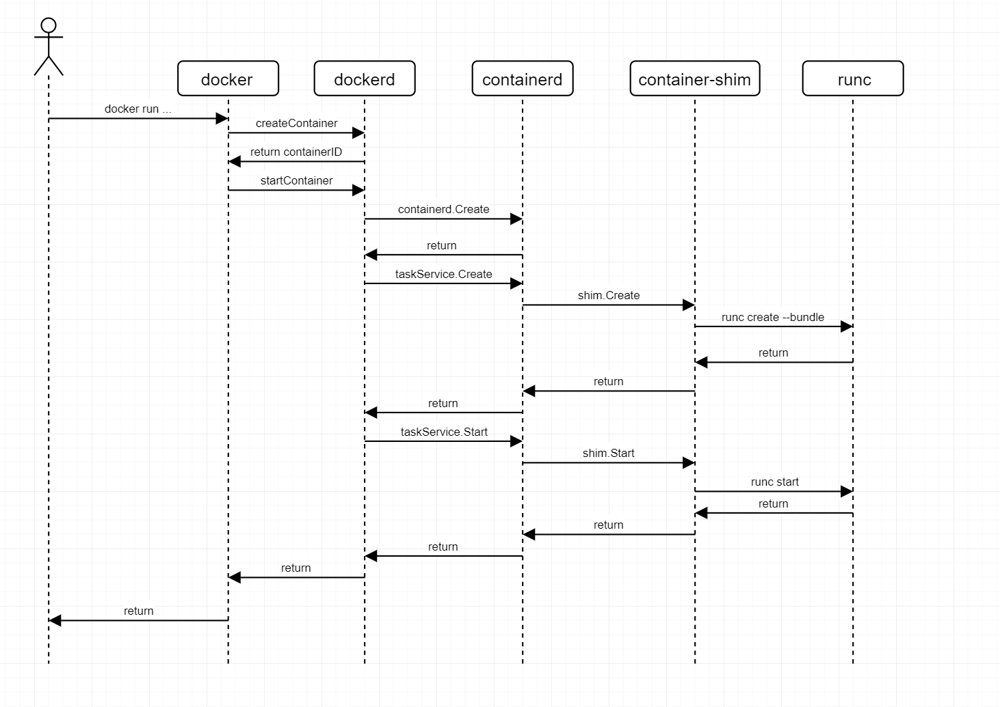
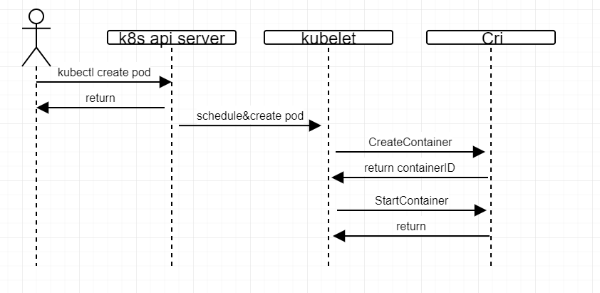

# An introduction to docker / kubernetes and how components interact with each other
##  A brief introduction to docker ecosystem
###  docker组件介绍
Docker生态环境中主要包含以下组件:

+ docker cli  
docker命令行工具, 用户通过docker命令与docker daemon交互. 
+ docker engine
docker engine一般在操作系统上以守护进程启动, 又称为docker daemon, 应用程序为dockerd, 监听docker命令行工具发送的请求并通过containerd管理host上容器的生命周期.  docker engine可以通过三种方式监听docker命令行工具的请求, unix domain socket, tcp和systemd通过socket activation[1]技术为dockerd打开的socket文件句柄.  
+ containerd
containerd是行业标准的容器运行时(container runtime), 可以作为Linux和Windows的守护程序使用, 可以管理其主机系统上容器的完整生命周期: 镜像传输和存储, 容器执行和监控,  容器存储管理, 网络空间管理. 
+ containerd-shim
containerd-shim 允许容器脱离守护程序. containerd-shim在调用runc启动容器后, 允许runc退出, 这样, 就不再需要为容器设置长时间运行的运行时进程. 另外, containerd-shim保持STDIO以及为容器所打开的句柄, 以免containerd或者dockerd守护进程挂了. (换句话说, 容器进程的父进程是containerd-shim, 而不是dockerd或者containerd). 最后, contianerd-shim会监视容器进程, 将容器返回值(exit status)层层传递给dockerd, 而不需要dockerd调用wait等待容器进程退出. 
+ runc 
 runc前身为 /usr/bin/docker-runc (OCI[2] runtime), 用于运行根据以OCI format打包的, 且符合OCI规范的应用. 
###  docker启动流程分析
docker命令 docker run ... 运行的背后由docker/dockerd/containerd/container-shim/runc的共同配合完成, 主要分为以下几个步骤:

1. docker命令行根据用户输入调用对应的子command, 根据命令行输入, 封装成 CreateContainerRequest发送给 dockerd
2. dockerd收到创建容器的请求后, 根据CreateRequest以及本地配置信息生成相应的Container信息, 存在ContainerStore供后续使用, 并将ContainerID返回给docker
3. docker根据收到的ContainerID, 发送StartContainerRequest到dockerd
4. dockerd在收到StartContainerRequest后,   发送Create请求(包括containerID, container spce)到containerd
5. containerd在收到dockerd发送的create请求后, 将container配置信息放到bbolt数据库中, 并返回CreateResponse给dockerd
6. dockerd在收到containerd返回的请求, 确认containerd已经创建保存相应的container信息后, 发送CreateTaskRequest到containerd
7. containerd在收到CreateTaskRequest后, 首先创建shim实例(即启动containerd-shim进程), 然后发送Create请求到containerd-shim实例
8. containerd-shim实例收到请求后, 调用go-runc包装的runc接口, 创建容器, 调用容器内preStartHooks, 启动容器进程, 然后依次返回
9. dockerd在收到taskService.Create的response后, 再次发送taskService.Start, 依次调用containerd, containerd-shim, runc之后, 容器内进程开始运行. 

下图展示了docker完整的交互流程:  


###  nvidia-docker容器虚拟化组件介绍
nvidia-docker主要包含nvidia-docker, nvidia-container-runtime, nvidia-container-toolkit(又称nvidia-container-runtime-hook), nvidia-container-cli. 各部分功能介绍如下:

 + nvidia-docker其实就是对docker命令的一个包装, 当子命令为run/create容器时, 调用docker命令行时加上runtime配置, 即使用nvidia-runtime
 + nvidia-container-runtime  docker命令行传来的run/create容器请求中带有runtime信息, dockerd根据daemon.json中的配置, 通过runtime的名称找到对应的runtime配置, 调用containerd-shim, containerd-shim再调用对应的nvidia-container-runtime来更新容器config.json, 增加preStartHook(即增加nvidia-container-runtime-hook)
daemon.json示例如下:
```json
{
    "hosts":["unix:///var/run/docker.sock", "tcp://0.0.0.0:5555"],
    "storage-driver": "overlay2",
    "storage-opts": [
        "overlay2.override_kernel_check=true",
        "overlay2.size=20G"
    ],
    "data-root": "/SkyDiscovery/docker",
    "insecure-registries": ["10.0.30.130:30980", "192.168.20.38", "10.115.1.130:9991", "172.17.0.4:36976"],
    "runtimes": {
        "nvidia": {
            "path": "/usr/bin/nvidia-container-runtime",
            "runtimeArgs": []
        }
    },
    "default-runtime": "runc",
    "log-driver": "json-file",
    "log-opts": {
        "max-size": "10m",
        "max-file": "3"
    }
}
```
 + nvidia-container-hook  内部调用nvidia-container-cli检查GPU的capacities等工作. 

 + nvidia-container-cli  此部分源码为cpp, 主要功能为配置容器的capacity


P.s. 其中4的具体功能有待了解docker之后再深入. 

##  An introduction to Kubernetes Device Plugin


###  Kubernetes Device Plugin开发简介
Kubernetes Device Plugin启动时, 首先与本机kubelet通信, 调用Register函数注册当前Device Plugin管理的资源类型, 当前Device Plugin的通信地址, 然后Device Plugin持续监听新连接, 并提供两个接口, 分别是ListAndWatch和Allocate. 

Device Plugin Servie Interface接口源码:
```go
service DevicePlugin {
        // ListAndWatch returns a stream of List of Devices
        // Whenever a Device state change or a Device disappears, ListAndWatch
        // returns the new list
        rpc ListAndWatch(Empty) returns (stream ListAndWatchResponse) {}
 
        // Allocate is called during container creation so that the Device
        // Plugin can run device specific operations and instruct Kubelet
        // of the steps to make the Device available in the container
        rpc Allocate(AllocateRequest) returns (AllocateResponse) {}
}
```


+ ListAndWatch返回一个长连接, 当管理的设备状态发生改变, 或者设备消失时, 发送新的设备列表. 
+ Allocate则在kubelet创建container时, 为container分配设备. 

###  Kubernetes中启动容器流程
在Kubernetes中创建pod直到启动相应的容器, 主要由kubernetes api server, kubernetes scheduler, kuberlet, cri共同完成. 

1. 用户使用kubectl 提交一个pod到kubernetes api server
2. kubernetes scheduler调度pod到指定节点, 提交创建pod请求到kubelet
3. kubelet根据pod的spec, 通过grpc远程调用cri的方法, 完成容器创建\启动. 

K8s中创建并启动容器的流程如图所示 


P.s. 
1. Kubernetes自1.15版本已将container runtime相关包(pkg/kubelet/apis/cri/runtime/v1alpha2) 移动到项目cri-api. 参见https://github.com/kubernetes/kubernetes/commit/33081c1f07be128a89441a39c467b7ea2221b23d#diff-e6c4c5558f0bcbb7f21adacb1bb15664
2. 上图中省略了kubernetes scheduler, 实际是由kubernetes scheduler与kubelet交互, 完成pod调度的. 
3. kubernetes中runtimeClass配置的就是此处的cri组件通信地址. 

## 参考文献
+ http://0pointer.de/blog/projects/socket-activated-containers.html
+ https://www.opencontainers.org/about
